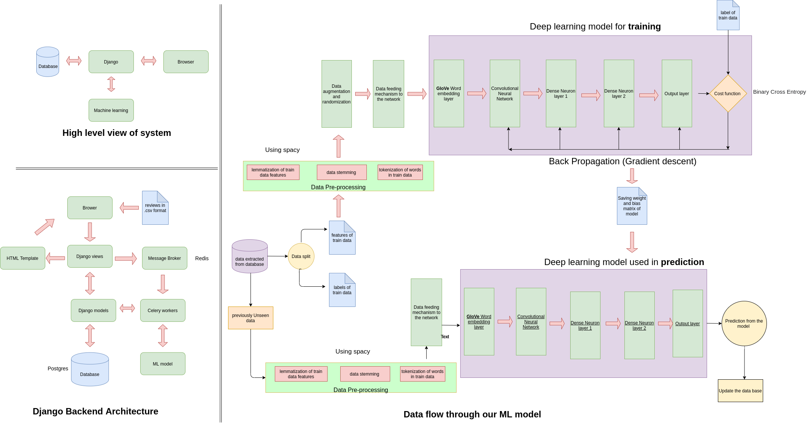
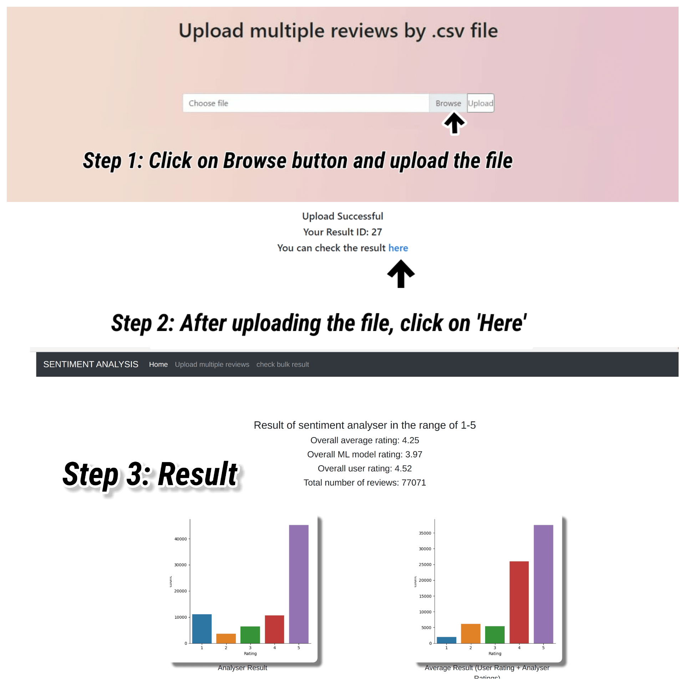
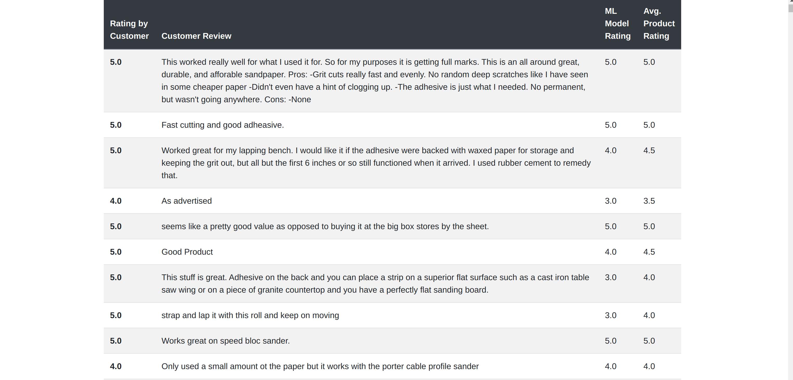
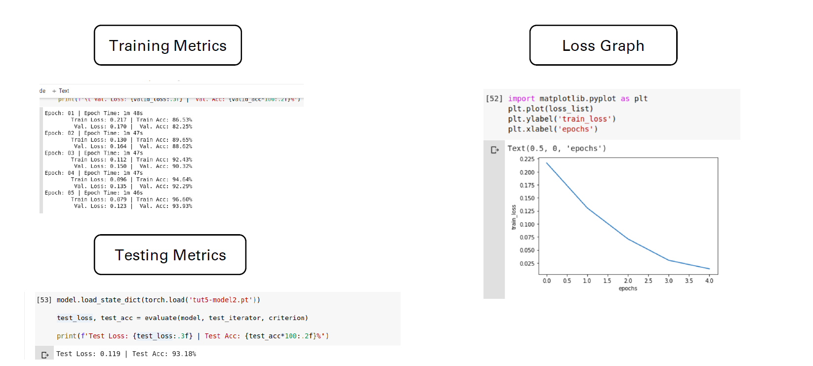
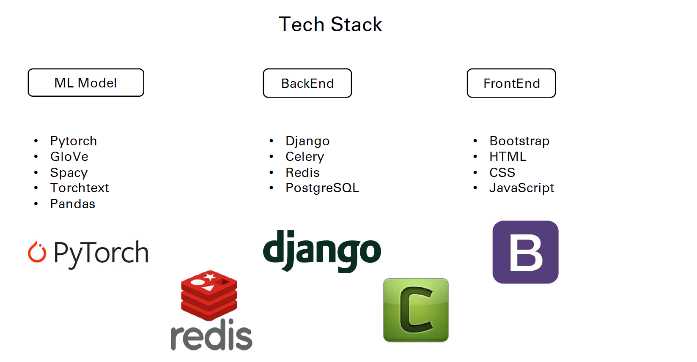

# NM396_Code_Black
This is project repository of team __Code.Black()__ for problem statement __NM396__ by __ISRO__ under the __Smart India Hackathon 2020__. 

Our aim for this project is to make a ML model to assist in __senitment classification__ of customer reviews received in the [Bhuvan](https://bhuvan.nrsc.gov.in/bhuvan_links.php) web portal.

## Road Map
- Build the backend and frontend services to service queries. Create a protoype ML model. :white_check_mark:
- Enhance ML model performance and hyperperameter tuning. :white_check_mark:
- Integration of model with the web service. :white_check_mark:
- Final touches and code refactoring to bring maximum performance and to make the code more efficient and maintainable. :white_check_mark:

## How To Run Locally:

**Step-1** Clone the repo to your system.

**Step-2** Download and install a PostgreSQL database, for ubuntu/debian users https://www.youtube.com/watch?v=M4RDizdaO9U  

**Step-3** Create new user and database in Postgres. 

**Step-4** Change the database credentials in `code_black/settings.py` with the ones you created in Step-3. 

**Step-5** Run command: `pip install -r <path to file>/requirements.txt`

**Step-6** Run command: `python manage.py migrate`

**Step-7** Run command: `python manage.py runserver`

**Step-8** Switch to another terminal.

**Step-9** Download and install Redis, https://redis.io/topics/quickstart.

**Step-10** Make sure you in the directory `$<path to clone>/NM396_Code_Black/code_black/` before you run command in next step.

**Step-11** Run command: `celery -A code_black worker -l info`

## Django - ML model architecture

## Stepwise Functionality
### Bulk Upload 

### Singular Review

# We do things differently

## We use CNN. Why?
- Less runtime after training
- Less weights to be trained
- Model size is relatively small for same accuracy
- Work on low power machines.

## We use Job Queueing. How & Why?
- Celery for an **asynchronous task queue** based on distributed message passing.
- Redis as blazing fast **message broker**.
- We **need not wait** because somebody else uploaded a csv file with **1 lakh entries**.

## Result?
- ML model with **93% accuracy**.
- We can handle **multiple requests simultaneously** without choking.

## Model in the Making

# It was not always at 93 %
- We changed the training data size from **80k to 4 lakh**.
- Introduced **learning rate decay**.
- Switched from **100 dimension embedding to 200 dimension of GloVe** so that we have more trainable paramteres.
- Introduced **dropout regularization**.
- Increased embedding vocabulary size from **25k to 1 lakh**.
> And of course hours of hard work by the team :)

# Our Tech Stack

# Summary
- **93 % accuracy** with ML model. Bulk reviews handled via job queueing using **Celery + Redis**.
- Tested **77k** reviews under **600 seconds of CPU time** using ngrok.
- Compatible with both GPU and CPU.
- Can be easily integrated with the **BHUVAN** database.
- Can be used via Mobile devices as well. (responsive web design)
- API support can also be provided easily using **Django REST**.

