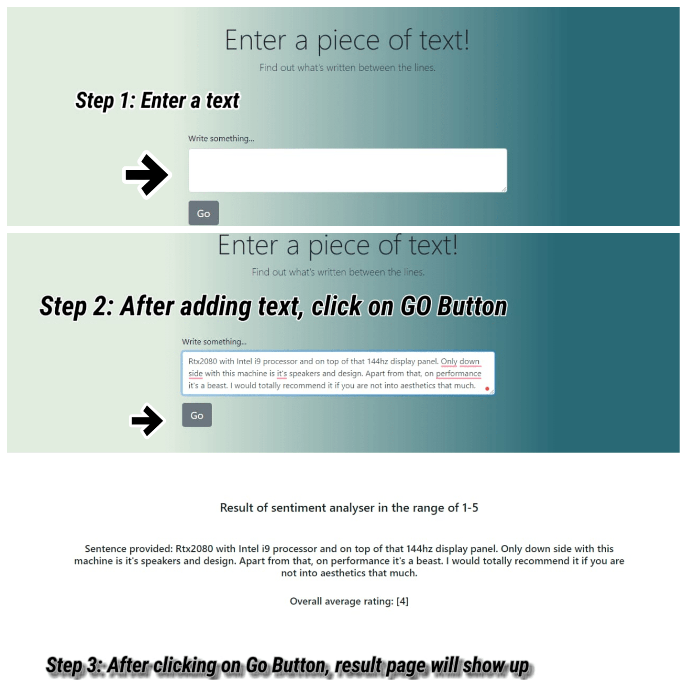

# NM396_Code_Black
This is project repository of team __Code.Black()__ for problem statement __NM396__ by __ISRO__ under the __Smart India Hackathon 2020__. 

Our aim for this project is to make a ML model to assist in __senitment classification__ of customer reviews received in the [Bhuvan](https://bhuvan.nrsc.gov.in/bhuvan_links.php) web portal.

## Road Map
- Build the backend and frontend services to service queries. Create a protoype ML model. :white_check_mark:
- Enhance ML model performance and hyperperameter tuning. :white_check_mark:
- Integration of model with the web service. :white_check_mark:
- Final touches and code refactoring to bring maximum performance and to make the code more efficient and maintainable. :white_check_mark:

## How Run locally:

**Step-1:** Clone the repo to your system.

**Step-2:** Download and install a PostgreSQL database, for ubuntu/debian users https://www.youtube.com/watch?v=M4RDizdaO9U  

**Step-3:** Create new user and database in Postgres.

**Step-4:** Change the database creads in `code_black/settings.py`

**Step-5:** Run command: `pip install -r <path to file>/requirements.txt`

**Step-6** Run command: `python manage.py migrate`

**Step-7** Run command: `python manage.py runserver`

**Step-8** Switch to another terminal.

**Step-9** Download and install Redis, https://redis.io/topics/quickstart.

**Step-10** Run command `cd code_black`

**Step-11** Run command: `celery -A code_black worker -l info`

## Django - ML model architecture

## Stepwise Functionality
### Bulk Upload 

### Singular Review

